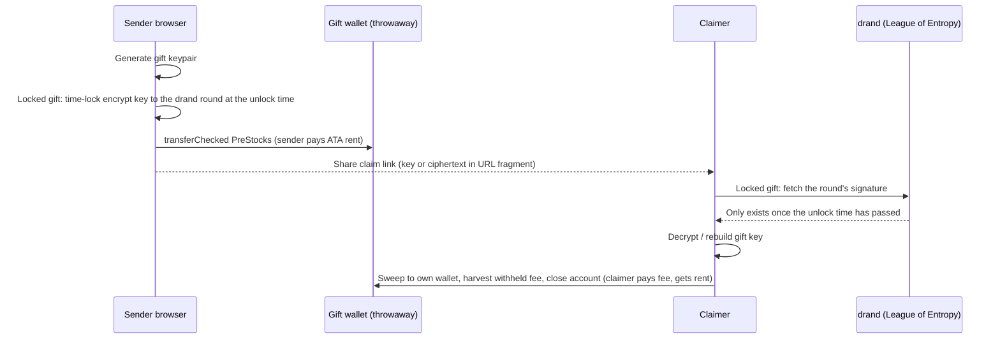

# SLING

**Give someone a piece of OpenAI before it IPOs, as a link, unlocked on their birthday.**

SLING lets anyone send pre-IPO stock exposure ([PreStocks](https://prestocks.com)) to anyone else as a shareable link, optionally **time-locked** until a date nobody (including us) can bypass. The recipient opens it, sees what they got, and claims it to their Solana wallet with one signature. No brokerage account, no paperwork, **no smart contract**.

Built for **[Stocklana](https://hackathons.solana.com)**: Solana Foundation main track + PreStocks "Best Use of PreStocks" bounty.

| | |
|---|---|
| Live app | https://sling-gift.vercel.app/ |
| Demo video (3 min) | https://youtu.be/NHpylwmfgp4 |
| Mainnet gift wallet | [CjiV5V…97o3m](https://solscan.io/account/CjiV5Vx97igDne2qWXHRivJ4w8QJNJetUGyQQAT97o3m) |
| Mainnet gift created | [5j5rEg…QJRP3C](https://solscan.io/tx/5j5rEg4cRJoXDiKRYdr7CT5RieDCk7oe2xnWAH3aPaR26fnb69apGNjmX5PNRLJKENg7LJSgZuQ1qhj7ySQJRP3C) |
| Mainnet gift taken back (sweep, fee harvest, account closed) | [4WfWYd…fNSu5iod7](https://solscan.io/tx/4WfWYdarxzhG4S4zHGvrnk98w1wFTqa6FbntQYU5WQijXx5UqpUaeEjeHkkYJEoYRH6PLqpcuguXCnMNfSu5iod7) |
| Blink on X | Actions API live; applied to the [Dialect registry](https://docs.dialect.to/blinks/blinks-provider/blink-registry), approval pending (see [Blinks on X](#blinks-on-x)) |

---

## The problem

Gifting stock means brokerage accounts, KYC and paperwork on both sides. Gifting **pre-IPO** exposure is effectively impossible for retail. PreStocks made pre-IPO exposure ownable on Solana, but there's no simple way to *share* it.

## How it works

1. **Create.** The sender picks a PreStock (OpenAI, Anthropic, Anduril, Neuralink…), types a dollar amount, optionally locks it until a date, and adds a message. Their browser generates a throwaway **gift wallet** and the sender signs one transaction that moves the PreStocks into it.
2. **Save, then share.** The sender first saves a private **recovery link** (copy, download or save in the browser, confirmed by a checkbox), then shares the **claim link** (copy, WhatsApp, QR, or post to X as a Blink).
3. **Claim.** A locked gift shows a live countdown and an "Add to calendar" button until it opens. Then the recipient opens the link, sees the company, amount, USD value and message, connects a wallet and signs once. The gift wallet's whole balance sweeps to them, and the emptied gift account is closed so its ~0.002 SOL rent goes back to them too. They pay the (sub-cent) network fee; the gift wallet never needs SOL.
4. **Take back.** If nobody claims it, the sender opens the recovery link and sweeps it back, even while it is still locked.

The gift's entire state is the gift wallet's on-chain balance. Its secret lives only in the links. There is no database and no program to trust.



### Why Solana

- **Blinks** turn a link into a one-tap claim right inside X (once registered, see below).
- **Fees** low enough that a $10 gift makes sense.
- **PreStocks only exist on Solana.**

## Links

| Link | Carries | Shape |
|---|---|---|
| Claim, immediate (web) | gift wallet + key | `/claim/<wallet>#k=<seed>&m=<message>&f=<from>` |
| Claim, locked (web) | gift wallet + unlock time + ciphertext | `/claim/<wallet>?u=<unix>#c=<ciphertext>&m=…&f=…` |
| Claim (Blink) | same, in query | `/api/actions/claim?w=<wallet>&k=<seed>…` or `…&u=<unix>&c=<ciphertext>…` |
| Share on X | same, in query | `/b?w=<wallet>&k=<seed>…`, mapped to the Blink by `actions.json` |
| Recovery | gift wallet + **plaintext** key (+ unlock time) | `/recover/<wallet>#k=<seed>&u=<unix>&m=…` |

- The key is the 32-byte ed25519 seed in base58 (44 chars), so links stay short.
- Web links keep the secret in the **URL fragment**, which browsers never send to a server.
- The Blink link has to put it in the query string so the Actions server can co-sign. That route never logs URLs, and dev request logging is disabled.
- The app verifies that the key in a link actually controls the wallet in the link before showing anything.
- A locked claim link is ~900 characters (the ciphertext is ~800 base64url chars).

## Time-locked gifts

[drand](https://drand.love) quicknet, run by the League of Entropy, publishes a threshold BLS signature for a new round every 3 seconds, and every round number maps to a fixed time. With [`tlock-js`](https://github.com/drand/tlock-js) the sender's browser encrypts the gift key to the round at the unlock time. The only thing that can decrypt it is that round's signature, which doesn't exist until the network produces it. The claim page and the Blink retry until it does, then the claim is the same as an immediate gift.

The recovery link keeps the plaintext key, so the lock stops the recipient opening early but never stops the sender cancelling. We verified the round trip against mainnet drand: decrypting before the round returns *"too early to decrypt… decryptable at round N"*; after it, the exact seed comes back.

## Who can move the tokens

| Holder | Immediate gift | Locked, before unlock | Locked, after unlock |
|---|---|---|---|
| Claim link | Yes (first to sweep wins) | **No** | Yes |
| Recovery link (sender) | Yes | Yes | Yes |
| Our server | Only via Blink links it receives, and it keeps nothing | No | Only via Blink links it receives |
| PreStocks issuer (permanent delegate) | Yes | Yes | Yes |

## PreStocks and Token-2022 handling

Before writing any transfer code we checked every PreStocks mint on mainnet (24 Sep 2026):

| Extension | Finding | What we do |
|---|---|---|
| Transfer hook | Present but **no program set** | Refuse to build a gift if a mint ever gets one |
| Default account state | `initialized` (not frozen) | New gift/claimer token accounts work |
| Transfer fee | 1% today, **3% from epoch 1043** (SPACEX 1%) | Fee read live for the current epoch; UI shows net after the deposit hop *and* the claim hop |
| Scaled UI amount | OPENAI ×1.486, SPACEX ×5, others ×1 | Display units = raw ÷ 10^decimals × multiplier, honouring the pending-multiplier timestamp |
| Permanent delegate, pausable | Issuer-controlled | Disclosed on the claim page |

We also confirmed the PreStocks API's `supply` equals the *scaled* on-chain supply, so `tokenPrice` is per display unit: **USD value = display units × tokenPrice**.

All transfers use `transferChecked` on Token-2022. On claim or take-back, the same transaction harvests the gift account's withheld transfer fee to the mint (permissionless) and closes the account, returning its rent to whoever opened the gift. After that, a gift's "claimed or taken back" state and original amount are read from the gift wallet's transaction history. SPACEX is excluded from the picker because its PreStock must be converted by 12 March 2027.

`scripts/simulate.ts` dry-runs the real create and claim transactions against mainnet with `simulateTransaction`, using an existing holder's account (no keys, nothing sent):

```bash
npx tsx scripts/simulate.ts OPENAI
# OPENAI: decimals=9 multiplier=1.4861347 fee=100bps epoch=1042
# $10 → raw 4987470 (0.007412 OPENAI); claimer nets 0.007265
# CREATE: OK (26461 CU)
# CLAIM + harvest + close: OK (30009 CU)
# gift token account closed in simulation: true
```

## Architecture

One Next.js app (App Router) serves the UI and the Actions API. Nothing is deployed on-chain.

| Path | What |
|---|---|
| `/` | Create a gift: picker with live prices, USD amount → tokens → net after fees (with "Use max"), optional time-lock (1 week / 1 month / custom date and time, set in the recipient's time zone), message, sign. On phones it's a 5-step wizard. Then two steps: **save the recovery link** (copy / download / save in browser, confirmed by a checkbox), then **share the claim link** (copy, Share on X with an editable post and card-image preview, WhatsApp, QR) |
| `/claim/[wallet]` | Gift card + claim panel. States: locked (live countdown, add to calendar), unlocked, claimable, claiming (step list), success, claimed or taken back, not found, failed with retry |
| `/recover/[wallet]` | Recovery page: "Take it back" (with confirm dialog, works while locked), copy claim link, success and already-empty states |
| `/sent` | Gifts sent from this browser, with live on-chain status and links to each recovery page |
| `/api/actions/claim` | Solana Actions GET (card metadata; disabled with "Opens Oct 30" while locked, or when empty) / POST (decrypts if locked, returns the partially signed claim tx) |
| `/b` | Shareable link for X: gift-card preview tags for crawlers, forwards people to the claim page |
| `/api/actions/image` | 1:1 Blink share image (plus a 1200×630 `layout=wide` for link previews) (ready, locked, or claimed/taken back), public details only, never the key |
| `/actions.json` | Actions rules, with the spec's CORS headers |
| `/api/prestocks` | PreStocks API proxy (name, symbol, logo, mint, tokenPrice), cached 60s |
| `/api/rpc` | Allow-listed JSON-RPC proxy so the paid RPC key stays server-side |

| Layer | Choice |
|---|---|
| Web + Actions | Next.js 16, Tailwind 4 (light/dark with a toggle), `@solana/actions`, `@solana/web3.js`, `@solana/spl-token`, wallet adapter (Wallet Standard) |
| Time-lock | `tlock-js` 0.9 with drand quicknet |
| Prices and metadata | [PreStocks API](https://prestocks.com/api/prestocks) |
| RPC | Paid mainnet RPC (Helius etc.) via `SOLANA_RPC_URL` |
| Hosting | Vercel |

Key files: `src/lib/gift.ts` (keys, links, transaction builders), `src/lib/timelock.ts` (drand lock/unlock), `src/lib/mint.ts` (fees, multiplier, amounts), `src/lib/giftView.ts` (on-chain gift state), `src/app/api/actions/claim/route.ts` (Blink).

## Run it

```bash
cp .env.example .env.local   # add a mainnet RPC URL
npm install
npm run dev                  # http://localhost:3000
```

You need a Solana wallet holding a little SOL (~0.003 for the gift account rent and fees) and any PreStock ([buy on prestocks.com](https://prestocks.com)). Claim from a second wallet to see the full flow.

To try the Blink, deploy (the Actions API needs a public HTTPS URL) and use "Share on X". It posts a link on our own domain (`/b?…`) with no third-party Blink host in the path: X shows a gift-card preview, Blink clients follow `actions.json` (`/b` → `/api/actions/claim`), and anyone who clicks is forwarded to the claim page with the key moved into the URL fragment.

To demo a lock, pick **Lock until… → Custom date** and set a time two minutes out. The claim page counts down, refuses to open, then opens on time.

### Blinks on X

The Actions endpoints (`/actions.json`, `/api/actions/claim`) are live and spec-compliant. Wallet extensions (Phantom, Backpack, Dialect) only unfurl Actions listed as trusted in the [Dialect Actions Registry](https://docs.dialect.to/blinks/blinks-provider/blink-registry), which is reviewed manually. We've applied (25 Sep 2026) and approval is pending. Until it's approved:

- On X, the post shows our gift-card preview and the link opens the claim page, so every gift is still claimable in one signature.
- The Blink itself works: paste a gift's Share on X link into [dial.to](https://dial.to), or use a Blinks client with `securityLevel: "all"`.

## Roadmap

- **Shipped:** P0 bearer gift links, P1 time-locked gifts, P2 "Gifts sent" and rent recovery.
- **Conversion deadlines:** a PreStock whose company IPOs must be converted by a deadline. Deadlines live in `src/lib/config.ts` (SPACEX 2027-03-12, also excluded outright) and can be added without a code change via `NEXT_PUBLIC_CONVERSION_DEADLINES='{"ANTHROPIC":"2026-12-15"}'`. Unlock dates are then capped a week before the deadline, and the claim page and Blink warn "Claim before …".
- **Pending:** Dialect registry approval (applied 25 Sep 2026), so X unfurls gifts as native Blinks.
- **Next:** gifts funded in USDC, group gifts.

## Compliance

PreStocks track a private company's value and confer no ownership, voting or dividend rights, and aren't offered to U.S. persons. The claim page shows this notice. The app never custodies funds: tokens sit in the gift wallet and only link holders can move them.
